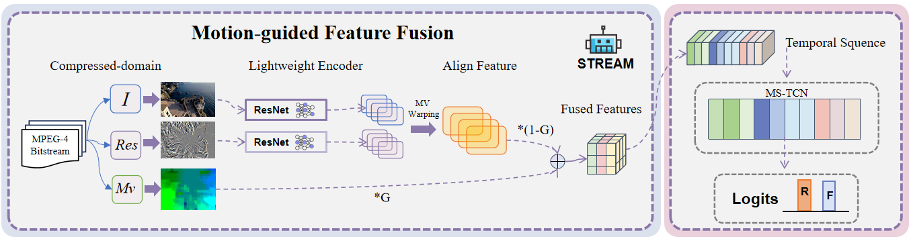

# STREAM

This repository contains the code for the paper "Beyond Pixels: Mining Compressed Domain Artifacts for Efffcient AI-Generated Video Detection" (accepted at ICMl 2026).

<p align="center">
  
</p>

## Overview

STREAM converts the three compressed video signals into a single prediction branch. The I-frame feature is motion-aligned with the motion vector field, fused with residual features through a learnable gate, and then aggregated by a temporal convolution module for video-level classification.

## Installation

Create a Python environment and install the required packages:

```bash
pip install -r requirements.txt
```

Build the compressed-video loading extension:

```bash
cd data_loader
bash install.sh
cd ..
```

The loader requires FFmpeg development headers and libraries to be available in your system environment.

## Data Format

Training and testing samples are provided by text files. Each line should contain a video path and its integer label:

```text
relative/path/to/video.mp4 0
relative/path/to/another_video.mp4 1
```

The path is resolved relative to `--data-root`. For binary classification, label `0` is real and label `1` is fake.

## Training

Example command for the 18+18 STREAM setting:

```bash
python train.py \
  --arch resnet18 \
  --data-name try \
  --representation stream \
  --data-root /path/to/video/root \
  --train-list /path/to/train.txt \
  --test-list /path/to/val.txt \
  --num_segments 8 \
  --gpus 0 \
  --save-dir ./ckpt/stream18
```

In this setting, `--arch resnet18` uses independent ResNet18 encoders for the I-frame and residual streams.

## Testing

```bash
python test.py \
  --data-name try \
  --representation stream \
  --data-root /path/to/video/root \
  --test-list /path/to/test.txt \
  --weights /path/to/checkpoint.pth \
  --arch resnet18 \
  --test_segments 8 \
  --gpus 0
```

The test script reports accuracy and class-wise metrics, and can optionally save prediction scores for further analysis.

## Acknowledgements

This repository benefits from the public implementations and data-loading utilities released by CoViAR and related compressed-domain video recognition projects.
